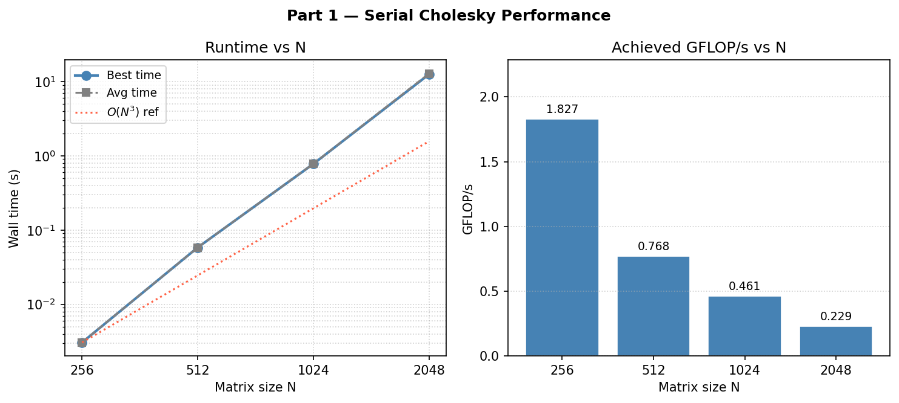
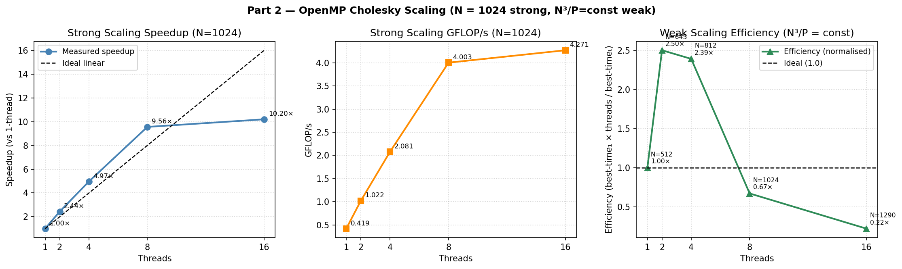
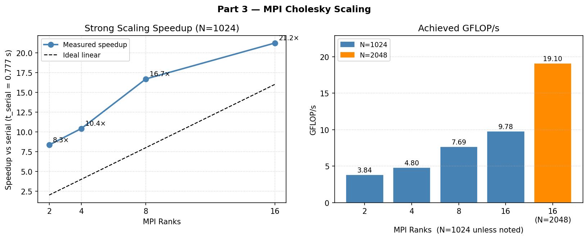
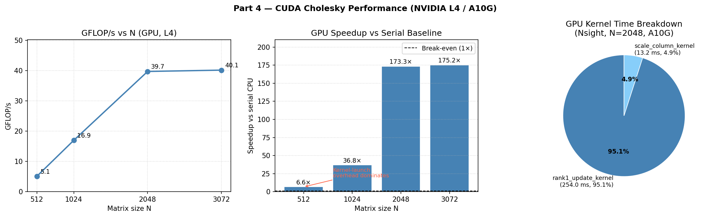
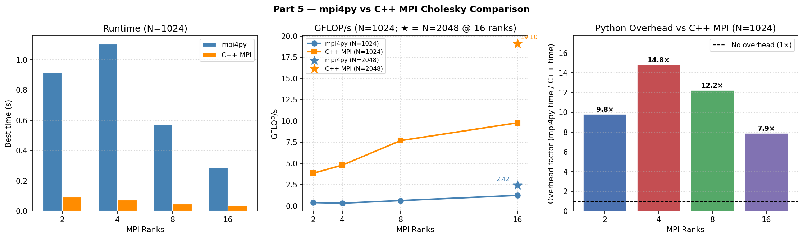

# Parallelizing Cholesky Factorization

## 1. Introduction

The Cholesky factorization is the workhorse of numerical linear algebra
for symmetric positive-definite (SPD) systems. A matrix is symmetric if it is equal to its own transpose ($A = A^T$), meaning its values are mirrored across the main diagonal, and it is positive-definite if for any non-zero vector $x$, the product $x^T A x$ is always strictly greater than zero. This guarantees that all its eigenvalues are positive and its "square root" can be calculated without involving imaginary numbers. Given an $N \times N$ SPD
matrix $A$, Cholesky produces a lower-triangular $L$ with $A = L L^T$. Once $L$
is known, solving $Ax = b$ reduces to two triangular solves; this is a
foundational primitive for least-squares regression (trend prediction), Gaussian processes (AI models),
Kalman filters (self-driving car sensors), and the Newton step in convex optimization (engineering design). The LAPACK
routine `DPOTRF` wraps it; here, I implement it from scratch so I can
control (and parallelize) every line.

The algorithm is the right-looking column-by-column formulation. For

each column $j = 0, \dots, N{-}1$:

$L_{jj} = \sqrt{A_{jj} - \sum_{k<j} L_{jk}^2}$, $L_{ij} = \frac{1}{L_{jj}}\Big(A_{ij} - \sum_{k<j} L_{ik} L_{jk}\Big);\ i > j.$

The total work is $\tfrac{1}{3} N^3$ floating-point operations. Two
features make Cholesky an interesting parallelization target. First, the
*outer* column loop is sequential: column $j$ depends on the entire
prefix $L_{:, 0:j}$. Second, the *inner* trailing-matrix update is a rank-1 outer product applied to the lower triangle of an
$(N{-}j)\times(N{-}j)$ block, which is embarrassingly parallel and dominates
the FLOP count. So Cholesky is essentially a long sequence of large
data-parallel updates with a thin synchronization barrier between them:
a textbook test case for Amdahl's law and for many important parallel paradigms in high-performance computing.

I implemented the same algorithm five times: serial C++, OpenMP, MPI,
CUDA, and mpi4py. Each version was
benchmarked on an AWS ParallelCluster. For profiling, I used Intel VTune to analyze the OpenMP implementation on CPU, and NVIDIA Nsight Systems to profile the CUDA implementation on GPU. All five produce
residuals $\lVert A - LL^T \rVert_F$ in the $10^{-12}\text{ to }10^{-10}$ range,
ensuring that the comparisons below are fair and directly comparable.

## 2. Methods

### 2.1 Serial baseline

The serial version ([serial/cholesky_serial.cpp](serial/cholesky_serial.cpp)) is a
straightforward column-major C++ implementation. The matrix is generated as $A = M^T M + N I$
with `srand(42)` so that every implementation can be cross-checked
against a deterministic reference. Timing uses
`std::chrono::steady_clock` around the factorization only; generation
and verification are excluded so that scaling numbers reflect true
algorithmic cost.

### 2.2 OpenMP

The OpenMP version ([openmp/cholesky_openmp.cpp](openmp/cholesky_openmp.cpp))
parallelizes only the inner loop. The diagonal $L_{jj}$ is computed
sequentially, then a single

```cpp
#pragma omp parallel for schedule(static)
for (int i = j+1; i < N; ++i) { /* row i update */ }
```

partitions the sub-diagonal rows across threads. Static scheduling is
optimal here because each row does the same amount of work
($O(j)$ FLOPS). There is one implicit team barrier per column which becomes the dominant overhead at high thread counts.

### 2.3 MPI

The MPI version ([mpi/cholesky_mpi.cpp](mpi/cholesky_mpi.cpp)) uses a
1D column-cyclic distribution: rank $r$ owns column $j$ iff
$j \bmod P = r$. Cyclic (rather than block) assignment keeps the load
balanced as the trailing matrix shrinks; every rank always holds
roughly $N/P$ columns of every width. For each column:

1. The owner factors its column locally (sqrt + scale).
2. `MPI_Bcast` sends the $(N{-}j)$-length column to all ranks.
3. Every rank applies the rank-1 trailing update to its own columns
   only.

Total bytes broadcast per rank is $\sum_j (N{-}j) \approx N^2/2$
doubles, while compute per rank is $O(N^3/P)$; the
compute-to-communication ratio grows like $O(N)$, so larger problems
amortize MPI overhead better. The Slurm script requests 2 nodes × 8
tasks/node = 16 ranks.

### 2.4 CUDA

The CUDA version ([cuda/cholesky_cuda.cu](cuda/cholesky_cuda.cu)) keeps
$L$ entirely in device memory. Per column $j$, three steps execute:

1. **Diagonal (host)**: `cudaMemcpy` reads one `double` D2H, the host
   takes the square root, writes $1/L_{jj}$ back H2D.
2. **`scale_column_kernel`**: 1D grid, 256 threads/block, scales
   $L_{i,j}$ for $i > j$.
3. **`rank1_update_kernel`**: 2D grid, 16×16 blocks, applies the
   rank-1 update over the lower triangle of the trailing block.

### 2.5 mpi4py (additional)

Re-implemented the MPI version in Python with mpi4py
([additional/cholesky_mpi4py.py](additional/cholesky_mpi4py.py)), using
the same 1D column-cyclic right-looking algorithm. The trailing
update is a single vectorised NumPy slice:

```python
L_loc[k:, lk] -= buf[k-j:] * Lkj
```

so the actual arithmetic runs in BLAS, but the column loop driver and
each `comm.Bcast` go through the Python interpreter. This gives a clean
measurement of "Python overhead per column" against the C++ MPI
baseline. 

## 3. Results

All times are best-of-3 wall-clock seconds for the factorization only.
GFLOP/s uses the conventional $N^3/3$ FLOP count.

### 3.1 Serial baseline



| N    | Best (s)  | GFLOP/s | Residual |
|------|-----------|---------|----------|
| 256  | 0.003062  | 1.827   | 5.10e-12 |
| 512  | 0.058234  | 0.768   | 2.65e-11 |
| 1024 | 0.776923  | 0.461   | 1.48e-10 |
| 2048 | 12.502958 | 0.229   | 8.40e-10 |

GFLOP/s decreases with $N$. This is the cache-pressure signature: at
N=256 the working set fits in L2; by N=2048 every column update streams
~32 MB through LLC, and the loop becomes memory-bound. This decay is
the motivation for every parallel version that follows.

### 3.2 OpenMP — strong and weak scaling



**Strong scaling at N=1024:**

| Threads | Best (s)  | Speedup | Efficiency |
|---------|-----------|---------|------------|
| 1       | 0.854345  | 1.00×   | 100%       |
| 2       | 0.350302  | 2.44×   | 122%       |
| 4       | 0.172024  | 4.97×   | 124%       |
| 8       | 0.089407  | 9.56×   | 120%       |
| 16      | 0.083800  | 10.19×  | 64%        |

Two things stand out. First, efficiency exceeds 100% for 2–8 threads, an example of
classic cache super-linearity. The 1-thread run is already memory-bound
(0.461 GFLOP/s vs. the 1.8 GFLOP/s achieved at the cache-resident
N=256), so distributing the working set across multiple core-private L2
caches eliminates the bottleneck. Second, 16-thread efficiency
collapses to 64%. The serial diagonal step plus the per-column barrier
form a fixed serial fraction, and Amdahl's law caps speedup once the
parallel piece is short enough that synchronization dominates.

The weak-scaling sweep (N grows so $N^3/P$ stays constant) tells the
same story from the other side: efficiency is super-linear at 2–4
threads (still cache-resident), then drops to 22% at N=1290 with 16
threads as the working set exceeds the shared LLC and DRAM bandwidth
becomes the wall.

### 3.3 MPI — distributing the working set



**Strong scaling at N=1024:**

| Ranks | Best (s)  | GFLOP/s | Speedup vs serial |
|-------|-----------|---------|-------------------|
| 2     | 0.093178  | 3.841   | 8.3×              |
| 4     | 0.074562  | 4.800   | 10.4×             |
| 8     | 0.046557  | 7.688   | 16.7×             |
| 16    | 0.036596  | 9.780   | **21.2×**         |

**Large-problem run (2 nodes, 16 ranks, N=2048):**

| Ranks | N    | Best (s)  | GFLOP/s | Speedup vs serial |
|-------|------|-----------|---------|-------------------|
| 16    | 2048 | 0.149886  | 19.103  | **83.4×**         |

The MPI numbers are significant. At N=1024 with
16 ranks the speedup is 21× against an ideal of 16×, and at N=2048 it
is 83×: five times the rank count. Essentially, the
serial run at N=2048 was thrashing LLC at 0.229 GFLOP/s, but with 16
distributed ranks each node holds only $\sim 1/16$ of the matrix and
the entire working set fits comfortably in cache. This approach doesn't simply parallelize computation; it partitions a bandwidth-bound problem into bandwidth-friendly chunks. This is the same effect OpenMP captured
at low thread counts, but MPI scales it across two physical nodes
without contention on a shared memory bus.

### 3.4 CUDA — single-GPU dense linear algebra



| N    | Best (s)  | GFLOP/s | Speedup vs serial |
|------|-----------|---------|-------------------|
| 512  | 0.008844  | 5.06    | 6.6×              |
| 1024 | 0.021121  | 16.95   | 36.8×             |
| 2048 | 0.072146  | 39.69   | 173×              |
| 3072 | 0.240840  | 40.13   | — (no serial run) |

At N=512 the GPU achieves only ~5 GFLOP/s (about one-eighth of its
own asymptotic throughput) because with only 512 columns the
per-column launch + memcpy overhead is comparable to the actual
rank-1 update work. The 6.6× speedup over serial is real but
unimpressive for a GPU; the more telling comparison is against the
40 GFLOP/s the same kernel sustains at larger N. By N=2048 the
per-column work has grown as $(N{-}j)^2$ and amortizes the fixed
overhead; sustained throughput plateaus near 40 GFLOP/s, which is
roughly 0.13% of the NVIDIA L4's theoretical peak. This performance
gap is attributed to the naive column-by-column approach, which
requires a synchronous kernel launch and a global barrier for every
column. 

### 3.5 mpi4py — the cost of abstraction



| Ranks | mpi4py (s) | GFLOP/s | C++ MPI (s) | Overhead |
|-------|------------|---------|-------------|----------|
| 2     | 0.914531   | 0.391   | 0.093178    | 9.8×     |
| 4     | 1.103367   | 0.324   | 0.074562    | 14.8×    |
| 8     | 0.569766   | 0.628   | 0.046557    | 12.2×    |
| 16    | 0.288484   | 1.241   | 0.036596    | 7.9×     |

Same algorithm, same cluster, same MPI library; yet Python is
8–15× slower. The overhead is fixed-per-column: 1024 trips through
the Python interpreter for the outer loop, plus 1024 `comm.Bcast`
binding calls. The 4-rank case is slower than 2-rank because more
ranks shrink the per-rank NumPy work but leave the Python+Bcast
overhead unchanged, so communication relatively dominates. 

## 4. Profiling

I profiled the two implementations whose bottlenecks were most
informative: OpenMP (Intel VTune) and CUDA (Nsight Systems).

### 4.1 VTune on OpenMP

The Hotspots analysis revealed exactly what the strong-scaling curve
predicted:

| Function | CPU Time | % | Type |
|---|---|---|---|
| `generate_spd_matrix` | 9.79 s | 70.1% | Effective (serial) |
| `cholesky_openmp._omp_fn.0` | 2.79 s | 20.0% | Effective (parallel) |
| `verify` | 0.67 s | 4.8% | Effective (serial) |
| `gomp_team_barrier_wait_end` | **0.67 s** | **4.8%** | **Spin** |
| Thread creation + other | 0.04 s | 0.2% | Overhead |

Setting aside the un-parallelized matrix generation (a real-world
artifact of the benchmark, not the algorithm), the interesting line is
the GOMP barrier: 0.65 s of the 0.67 s spin time was Imbalance / Serial
Spinning, with zero lock contention. Every column ends with 16 threads
waiting at a barrier for the next sequential diagonal step. That's the
Amdahl serial fraction made visible: the spin time is essentially the
cost of not parallelizing the diagonal. It's also why 16-thread
efficiency drops from 120% (at 8 threads) to 64%; once the parallel
section is short enough, the fixed barrier cost dominates each column.

### 4.2 Nsight Systems on CUDA

Nsight tells a similarly clean story. **GPU side:**

| Kernel | GPU Time | Instances | % of GPU Time |
|---|---|---|---|
| `rank1_update_kernel` | 254.0 ms | 8188 | **95.1%** |
| `scale_column_kernel` | 13.2 ms | 8188 | 4.9% |

Useful FLOPs are concentrated in the right place: 95% of GPU time is
the rank-1 update. The instance count (8188 ≈ 2048 columns × 4 runs)
matches the column-by-column loop exactly.

**Host side**, however:

| API Call | Host Time | Calls | Avg | % |
|---|---|---|---|---|
| `cudaMemcpy` | **392.4 ms** | 16,389 | 23.9 µs | **59.8%** |
| `cudaLaunchKernel` | 134.4 ms | 16,376 | 8.2 µs | 20.5% |
| `cudaMalloc` | 125.7 ms | 1 | 125.7 ms | 19.2% |

The primary performance bottleneck is identified in the `cudaMemcpy` function, which consumes 60% of all host API time even
though the actual GPU-side transfer time for those copies is only 28 ms
total. Every column issues a synchronous one-`double` D2H to read
$L_{jj}$, which forces an implicit `cudaDeviceSynchronize` and stalls
the host until the previous `rank1_update_kernel` finishes. Multiplied
by N=2048 columns, that 24 µs round-trip is the reason the GPU plateaus
at 40 GFLOP/s instead of pushing further toward peak. A single device
kernel that computes the diagonal in-place and passes $1/L_{jj}$
directly to the next launch would eliminate this.

The two profiles together capture the same lesson from opposite sides:
the right-looking column-by-column formulation is fundamentally limited
by the per-column synchronization point, regardless of whether the
synchronization mechanism is a GOMP barrier or a `cudaMemcpy`.

## 5. Conclusion

**OpenMP** is by far the easiest path to speedup on a single node; one
`#pragma` over the inner loop yielded ~10× at 16 threads. However, it
inherits the host's memory hierarchy, so cache pressure and barrier
imbalance bound the achievable efficiency. **MPI** unexpectedly
dominated the CPU comparisons: by partitioning the matrix across two
nodes' memory systems it broke the bandwidth wall that capped the
serial and OpenMP runs, hitting 83× speedup at N=2048, well above the
naive 16× ideal. The takeaway here is that for memory-bound kernels,
distributed memory is not just a way to add cores, it is a way to add
cache. **CUDA** was the strongest absolute performer at scale (40
GFLOP/s, 2× faster than 16-rank MPI at N=2048), but only after the
problem was big enough to amortize the per-column launch overhead;
Nsight Systems made the single-step optimization (eliminate the
diagonal D2H sync) immediately obvious. **mpi4py** delivered the same
algorithm in half the lines of code at an 8–15× performance cost, a
useful data point about where Python's vectorisation story holds up
(the inner update) and where it does not (a 1024-iteration Python-level
outer loop).

The performance data from both the CPU and GPU profiles suggests that the next logical progression is to transition from a column-by-column approach to a blocked implementation. By grouping columns into blocks (or panels), the algorithm would batch multiple operations into single, highly optimized mathematical calls. This architectural change would address the primary bottlenecks identified in this report by significantly reducing the synchronization frequency. In the OpenMP version, it would minimize the number of barriers where threads must wait. In the MPI version, it would allow for larger, more efficient data broadcasts across the network. And in the CUDA implementation, it would enable the GPU to process large workloads independently without constantly pausing to communicate with the host computer. Transitioning to this blocked design is essential to overcoming the current latency limits and achieving the full computational potential of the hardware.